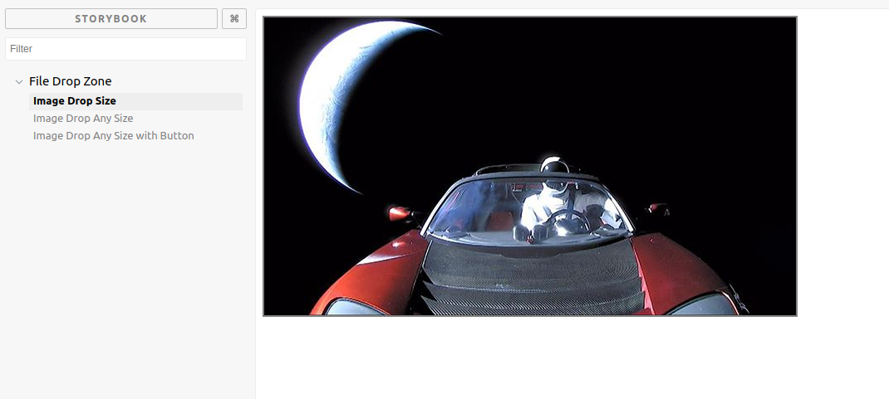

# React Image DropZone

A component that enables react developers to add image drag and drop to a page



[React Storybook](https://storybook.js.org/)

### Install

```bash
git clone git@github.com:dbroadhurst/react-storybook-package-boilerplate.git
npm install
```

### Run

```bash
npm run storybook
```

Open browser and navigate to http://localhost:9001
